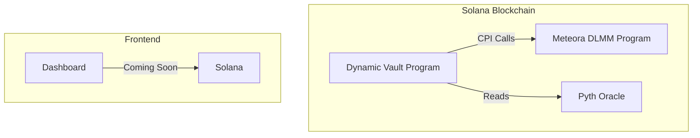
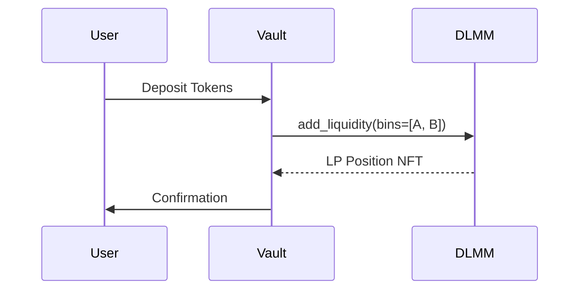
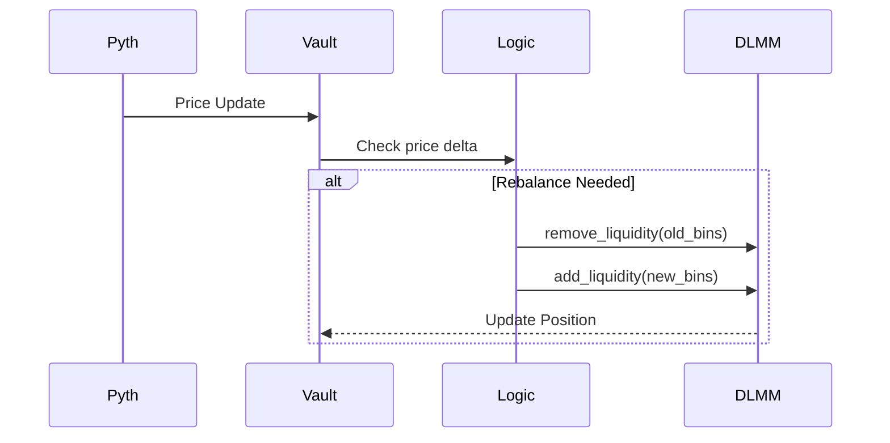

# 🚀 Dynamic Liquidity Vault 

A Solana smart contract that auto-rebalances liquidity positions in **Meteora's DLMM** based on price volatility and yield opportunities.


---

## 📌 Table of Contents
1. [Features](#-features)
2. [Architecture](#-architecture)
3. [Workflows](#-workflows)
4. [Setup](#-setup)
5. [Testing](#-testing)
6. [Deployment](#-deployment)
7. [Frontend](#-frontend)

---

## 🌟 Features
- **Auto-Rebalancing**: Adjusts DLMM bins based on Pyth oracle prices
- **Fee Tracking**: Records total fees earned from liquidity positions
- **Gas Optimization**: Minimizes CPI calls to Meteora DLMM
- **Admin Controls**: Secure vault initialization and management

---

## 🏗 Architecture



---

## 🔄 Workflows

### 1. Deposit Liquidity


### 2. Auto-Rebalance


---

## 🛠 Setup

### Prerequisites
- Rust 1.65+
- Solana CLI 1.16+
- Anchor 0.31.1

### Installation
```bash
# Clone repo
git clone https://github.com/yourusername/dynamic-vault.git
cd dynamic-vault

# Install dependencies
anchor build
```

---

## 🧪 Testing

### Run Unit Tests
```bash
anchor test --skip-local-validator
```

### Test Cases
| Test | Description |
|------|-------------|
| `initialize_vault` | Verify vault initialization |
| `deposit_liquidity` | Test adding liquidity to DLMM |
| `rebalance` | Verify bin updates on price changes |

---

## 🚀 Deployment

### 1. Deploy to Devnet
```bash
anchor deploy --provider.cluster devnet
```

### 2. Verify Program
```bash
solana program show 5WsnuvmE8uRrhoRQeEEo8wJBqhh4NrMcmADVqhjGD544
```

---

## 🌐 Frontend

### Getting Started
```bash
cd app
npm install
npm run dev
```

### Features
- Real-time vault stats dashboard
- Historical rebalance events timeline
- DLMM bin visualization
- Wallet connection and authentication
- Fee tracking and analytics

### Tech Stack
- Next.js 13 (React 18)
- Solana Web3.js
- Wallet Adapter
- TypeScript

---

## � License
MIT
